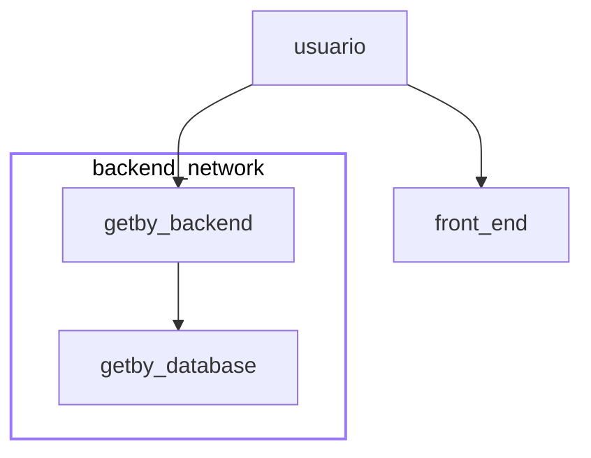

# Docker

Responsável: `Tsu`

Esse arquivo dá um pequeno resumo das partes mais importantes dos contâiners do aplicativo. A aplicação se baseia em 3 contâiners:



O `docker-comose` permite o uso de profiles, os profiles vão permitir escolher quais _containers_ vão ser executados. Foi criado dois _profiles_:

- _Deploy_
- _Test_

### Profile: Deploy

Para rodar o profile _deploy_ basta rodar o comando:

```sh
make start
```

O _profile_ `deploy` vai ser usado para rodar a aplicação que seria usada em produção. Os _containers_ `backend`, `frontend` e `database` vão ser executados.

#### Frontend

Imagem: `node:16`

Vaiáveis de ambiente:

- `NODE_ENV`=production
- `NODE_CONFIG_LOGLEVEL`=debug
- `NPM_CONFIG_PREFIX`=/home/getby/.npm-global

#### Backend

Imagem base: `python:3.10-slim`

Redes:

- `database`: vai conectar o banco de dados com o backend

Vaiáveis de ambiente:

- `UVICORN_PORT`=8000
- `UVICORN_HOST`=0.0.0.0
- `UVICORN_WORKERS`=1
- `POSTGRES_DB_FILE`=${POSTGRES\_DB\_FILE:?err}
- `POSTGRES_USER_FILE`=${POSTGRES\_USER\_FILE:?err}
- `POSTGRES_PASSWORD_FILE`=${POSTGRES\_PASSWORD\_FILE:?err}

Secrets:

- `db`: database/postgres-db.txt
- `user`: database/postgres-user.txt
- `senha`: database/postgres-passwd.txt

#### Database

Imagem base: `postgres:14.2-alpine`

Redes:

- `database`: vai conectar o banco de dados com o backend

Volumes:

- `postgres_db`: armazenar o banco de dados em um volume persistente

Vaiáveis de ambiente:

- `POSTGRES_DB_FILE`=${POSTGRES\_DB\_FILE:?err}
- `POSTGRES_USER_FILE`=${POSTGRES\_USER\_FILE:?err}
- `POSTGRES_PASSWORD_FILE`=${POSTGRES\_PASSWORD\_FILE:?err}

Secrets:

- `db`: database/postgres-db.txt
- `user`: database/postgres-user.txt
- `senha`: database/postgres-passwd.txt

### Profile: Teste

Para rodar o profile _test_ basta rodar o comando:

```sh
make test
```

O comando `make test` vai sempre limpar todos os _containers_ e vai executar os _containers_ `backend-test` e `database`.

O _container_ `backend-test` vai executar os testes usando o framework `pytest`. Mais informações podem ser encontradas [aqui](./backend)

#### Backend-test

Imagem base: `python:3.10-slim`

Redes:

- `database`: vai conectar o banco de dados com o backend

Vaiáveis de ambiente:

- `UVICORN_PORT`=8000
- `UVICORN_HOST`=0.0.0.0
- `UVICORN_WORKERS`=1
- `POSTGRES_DB_FILE`=${POSTGRES\_DB\_FILE:?err}
- `POSTGRES_USER_FILE`=${POSTGRES\_USER\_FILE:?err}
- `POSTGRES_PASSWORD_FILE`=${POSTGRES\_PASSWORD\_FILE:?err}

Secrets:

- `db`: database/postgres-db.txt
- `user`: database/postgres-user.txt
- `senha`: database/postgres-passwd.txt

#### Database

Imagem base: `postgres:14.2-alpine`

Redes:

- `database`: vai conectar o banco de dados com o backend

Volumes:

- `postgres_db`: armazenar o banco de dados em um volume persistente

Vaiáveis de ambiente:

- `POSTGRES_DB_FILE`=${POSTGRES\_DB\_FILE:?err}
- `POSTGRES_USER_FILE`=${POSTGRES\_USER\_FILE:?err}
- `POSTGRES_PASSWORD_FILE`=${POSTGRES\_PASSWORD\_FILE:?err}

Secrets:

- `db`: database/postgres-db.txt
- `user`: database/postgres-user.txt
- `senha`: database/postgres-passwd.txt
