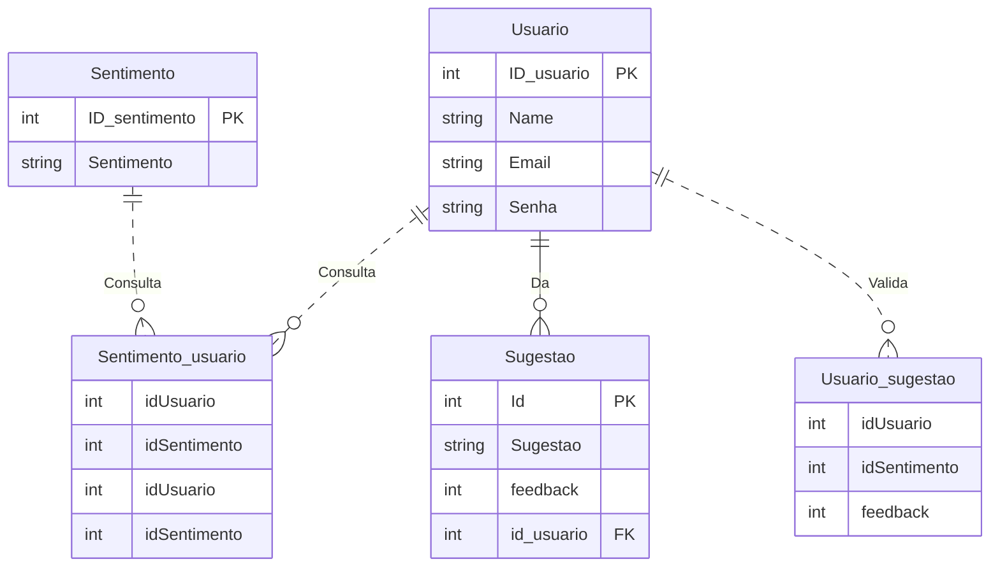

# Banco de dados

Responsáveis: `Gabriel`, `Guilherme`

Tecnologia: `postgres`

O banco de dados escolhido foi o [postgres](https://www.postgresql.org/)

Estrutura do banco de dados:

#### Usuario

- ID\_usuario: Identificador do usuário.
- Name: Nome do usuário.
- Email: Email do usuário.
- Senha: Hash da senha do usuário.

#### Sentimento

- ID\_sentimento: Identificador do sentimento.
- Sentimento: Nome ou descrição do sentimento.

#### Sentimento\_usuario

- idUsuario: Usuário que está sentindo determinado sentimento.
- idSentimento: Identificador para o sentimento do usuário

#### Sugestao

- Id: Identificador da sugestão.
- Sugestao: Texto que armazena a sugestão.
- Feedback: Quantidade de votos positivos e negativos que essa sugestão recebeu.
- id\_usuario: Usuário que deu determinada sugestão.

#### Usuario\_sugestao

- idUsuario: Usuário que deu feedback na sugestão.
- idSugestao: Sugestão que foi avaliada.
- feedback: Pode receber o valor de 1 ou -1.
