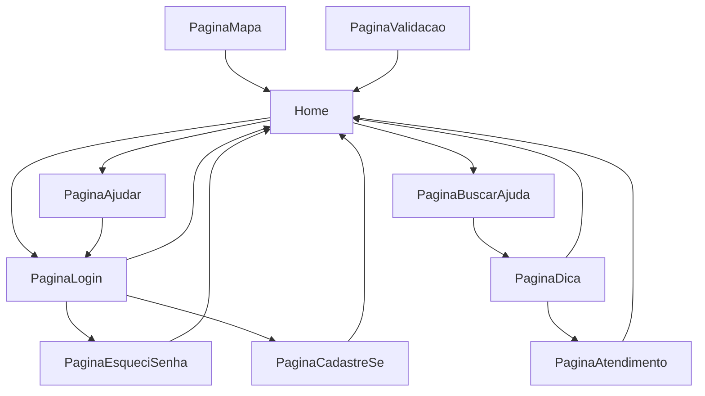

# Front end

Teconologia: `React`

Responsáveis: `Fernanda`, `Gabi`

#### Descrição

Figma: [link](https://www.figma.com/file/DGBdXRHWqwCtKJeKCfIwJ6/GetBy?node-id=0%3A1)

Jornada do usuário:

OBS: A `PaginaMapa` e `PaginaValidacao` podem ser acessadas por qualquer página.

#### Arquivos

- `.nginx`: Arquivo de configuração para o _container nginx_.
- `frontend.Dockerfile`: Arquivo para criar o _container_ do _front end_.
- `*`: Código fonte do front.
